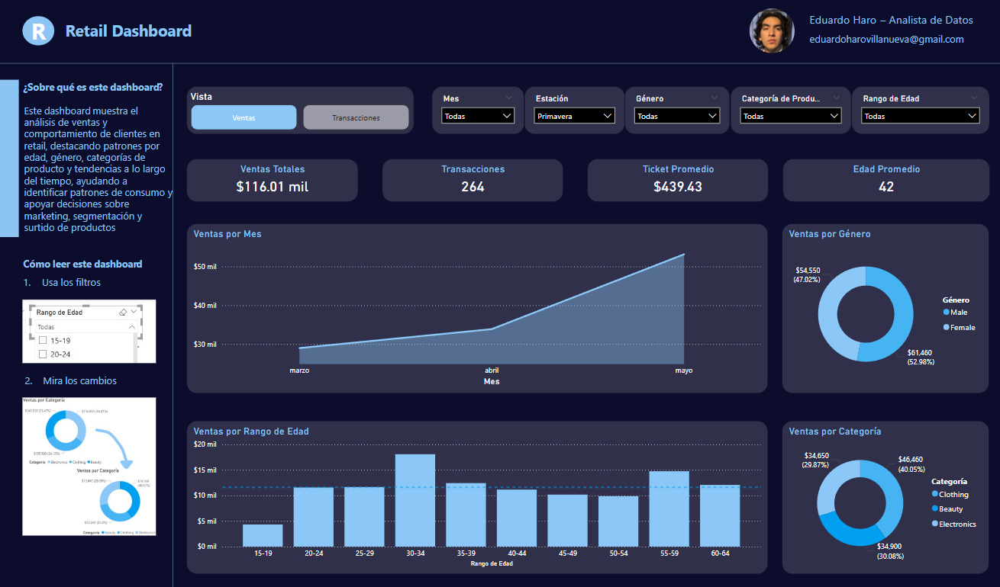
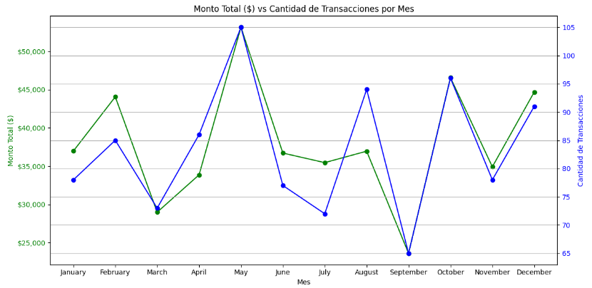
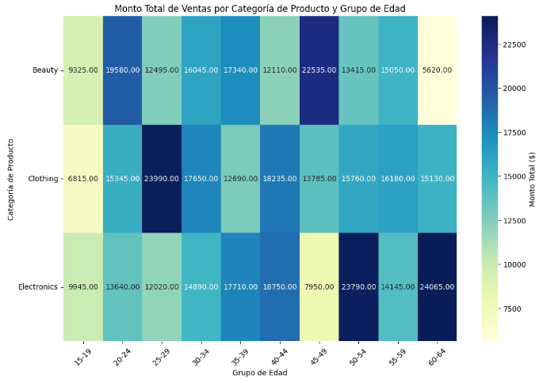

# 🛍️ Análisis Exploratorio de Ventas Retail

Este proyecto forma parte de mi portafolio como Analista de Datos y está enfocado en analizar patrones de comportamiento y ventas en el sector retail utilizando un dataset sintético. El objetivo es extraer insights útiles que ayuden a entender mejor a los clientes, sus preferencias y tendencias de compra.

---

## 📊 Descripción del Proyecto

**Business Question:**  
¿Cómo se comportan las ventas y preferencias de los clientes en función de variables como edad, género, tipo de producto y temporada del año?

**Metodología:**  
- Análisis exploratorio de datos (EDA)
- Visualizaciones con Matplotlib y Seaborn
- Transformación de datos para facilitar el análisis
- Generación de insights clave y recomendaciones accionables

**Archivo Principal:**  
El desarrollo completo del análisis se encuentra en el notebook [`Retail Analysis.ipynb`](Retail%20Analysis.ipynb), donde se documentan todos los pasos.

**Impacto:**  
Los hallazgos pueden ayudar a optimizar promociones, segmentación de clientes y gestión de inventarios por temporada y categoría de producto.

---

## 🧠 Dudas que respondí

📌 Analizar cómo influyen la edad y el género del cliente en su comportamiento de compra.  
📌 Identificar patrones de ventas a lo largo del tiempo.  
📌 Determinar qué categorías de productos tienen mayor atractivo entre los consumidores.  
📌 Estudiar la relación entre edad, gasto total y preferencias de productos.  
📌 Evaluar cómo varían los hábitos de compra en función de las temporadas.  
📌 Explorar si existen patrones de comportamiento según la cantidad de productos comprados por transacción.  
📌 Analizar la distribución de precios por categoría de producto y qué información se puede extraer de ello.

---

## 🖼️ Visualizaciones del Proyecto

A continuación, se muestran algunas de las visualizaciones generadas durante el análisis:

### 📌 Dashboard General en Power BI

### 📈 Gráfico Evolutivo

### 📈 Mapa de Calor

---

## 🛠️ Herramientas y Librerías

- Python (pandas, numpy, matplotlib, seaborn)
- Jupyter Notebook
- Power BI (para visualización adicional en dashboard)
- Git y GitHub para control de versiones

---

## 📁 Estructura del repositorio
📦 p-retail-eda

├── Retail Analysis.ipynb          # Notebook con el análisis exploratorio completo

├── retail_sales_dataset.csv       # Dataset utilizado para el análisis

├── README.md                      # Archivo de documentación del proyecto

└── Retail Dashboard.pbix          # Dashboard en Power BI

---

## 📈 Dashboard en Power BI

Este análisis también fue visualizado en Power BI como parte de una solución de reportes interactivos.

🔹 Puedes descargar el archivo aquí:  
[📁 Retail Dashboard.pbix](./Retail%20Dashboard.pbix)

---

## 📌 Notas

- El dataset fue tomado de Kaggle y ya se encontraba limpio.
- Se realizaron transformaciones como la creación de grupos de edad, segmentación estacional, y normalización de columnas para facilitar el análisis.
- El código está comentado paso a paso para mayor comprensión.

---

## 📚 Dataset

Fuente: [Kaggle - Retail Sales Dataset](https://www.kaggle.com/datasets/mohammadtalib786/retail-sales-dataset/data)

---

## 📬 Contacto

¿Tienes sugerencias o quieres colaborar?  
¡Contáctame por [LinkedIn](https://www.linkedin.com/in/eduardo-alfonso-haro-villanueva-baa50a261/) o revisa más proyectos en mi [portafolio](https://portafolio-eharo.carrd.co/)!

